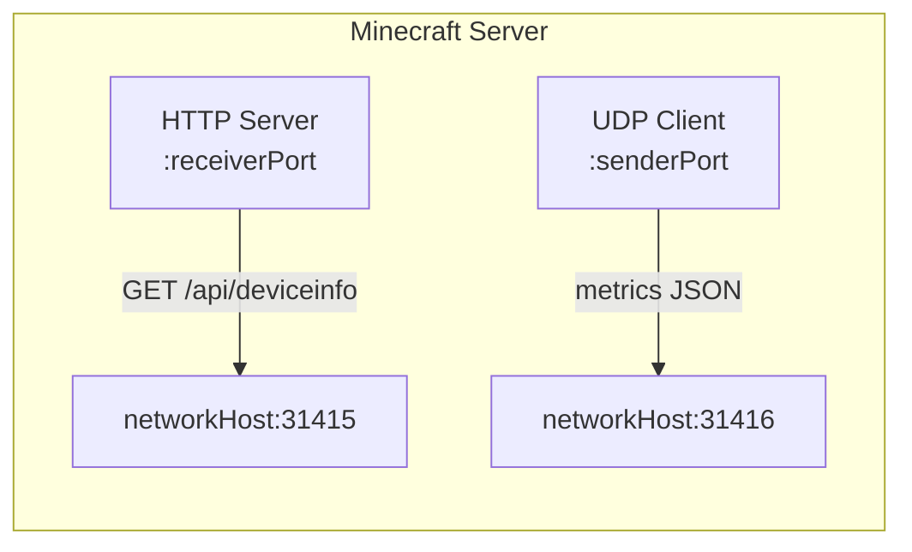

# Network API

The network feature provides two protocols for integrating with monitoring tools.

## Overview

| Protocol   | Purpose                              | Default Port |
|------------|--------------------------------------|--------------|
| HTTP (TCP) | Query device/system information      | 31415        |
| UDP        | Fire-and-forget metrics transmission | 31416        |

## HTTP API (TCP) - Device Info

### Endpoint

```
GET http://host:receiverPort/api/deviceinfo
```

### Example

```bash
curl http://localhost:31415/api/deviceinfo
```

### Response

```json
{
  "deviceType": "PC",
  "deviceModel": "Intel Core i7-12700K",
  "cpuName": "Intel Core i7-12700K",
  "cpuCores": 12,
  "gpuName": "NVIDIA GeForce RTX 3080",
  "totalMemoryBytes": 34359738368,
  "osName": "Windows",
  "osVersion": "11",
  "osArch": "amd64",
  "javaVersion": "21",
  "chipRulesTrusted": true
}
```

## UDP Metrics

### Overview

- **Protocol:** UDP datagrams
- **Port:** `senderPort` (default 31416)
- **Format:** JSON

### Characteristics

- **Fire-and-forget**: No delivery confirmation
- **Packet loss**: Silent and unrecoverable
- **Payload**: Single JSON message per datagram

### Message Format

```json
{
  "sessionId": "a1b2c3d4-e5f6-7890-abcd-ef1234567890",
  "timestamp": 1743849600000,
  "sampleNumber": 1,
  "data": {
    "fps": 144.0,
    "tps": 20.0,
    "mspt": 0.95,
    "heapUsed": 512,
    "heapMax": 2048,
    "cpu": 25.5
  }
}
```

## Configuration

| Setting           | Default     | Description                               |
|-------------------|-------------|-------------------------------------------|
| `network_enabled` | `false`     | Enable network features                   |
| `network_host`    | `localhost` | Host for HTTP binding and UDP destination |
| `receiver_port`   | `31415`     | HTTP server port                          |
| `sender_port`     | `31416`     | UDP destination port                      |

See [Configuration](CONFIGURATION.md#network-settings) for details.

## Testing

### Start UDP Test Server

```bash
python tools/test_udp_server.py --port 31416
```

### Test with curl

```bash
# Query device info
curl http://localhost:31415/api/deviceinfo
```

## Architecture



The `network_host` setting controls both:
- Where the HTTP server binds (listens)
- Where the UDP client sends metrics
